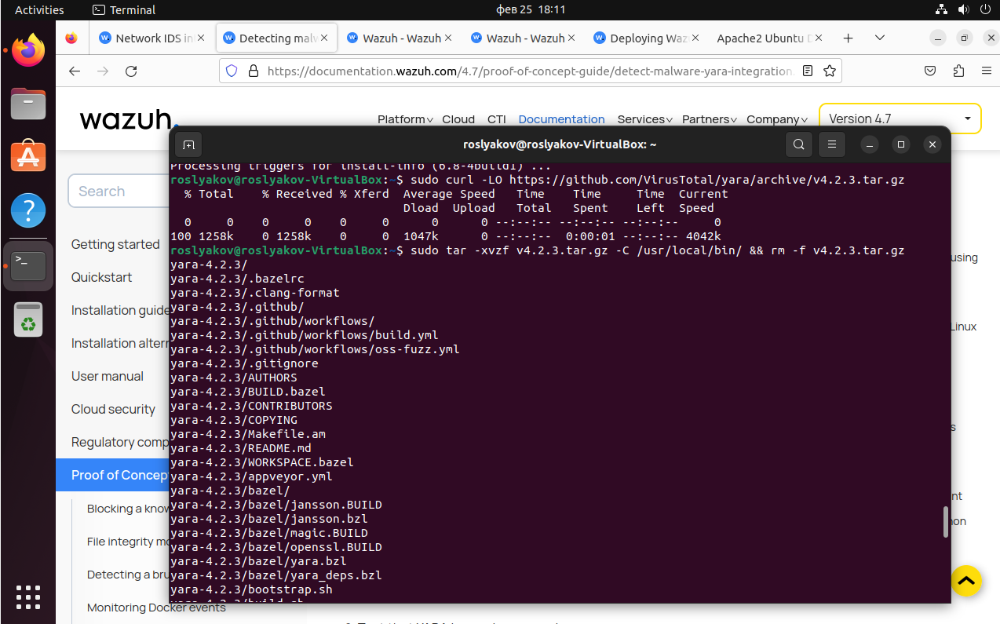

# Практическая работа №5 - Threat Hunting

**Выполнил студент группы ББМО-01-23 Росляков В.А.**

Для выполнения работы был использован стенд, аналогичный стенду из практической работы 3

Всего 3 виртуальные машины
1) Ubuntu с агентом Wazuh
2) Ubuntu с сервером Wazuh
3) Kali Linux

С хоста, с настроенным агентом имеем доступ по сети к хосту с сервером. Видим подключённый агент.

# IDS Suricata

Развернем дополнительно на защищаемом хосте IDS Suricata

Добавляем репозитории suricata

Устанавливаем

Также загружаем правила

Модифицируем конфиг

Внесем сбор логов сурикаты в конфиг Wazuh

Перезапускаем агент

После пробуем пропинговать хост с агентом и видим события от сурикаты

# Web-приложение

На защищаемом клиенте поднято пустое веб-приложение Apache

# Сканер уязвимостей Nikto

Запустим сканер уязвимостей Nikto с Kali

Также видим события от сурикаты

# YARA

Скачивание, компиляция и установка YARA

Проверяем, что установка прошла успешно

Загружаем правила

Создаём скрипт и устанавливаем привилегии в соответствии с документацией

Редактируем ossec конфиг

На сервере также настраиваем всё необходимое

Настраиваем правила для отслеживания изменений и срабатывания YARA-правил

Настраиваем декодер

Настраиваем команды для сканирования

Срабатывание правил Yara

Для проверки был создан реверс-шелл с помощью msfvenom. После его исполнения на хосте с агентом, получили доступ на кали

Также видим срабатывание правил в Wazuh

